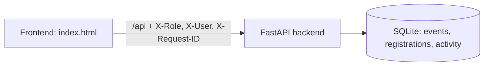

# Community Events Platform

Visitors browse published events and register anonymous interest, Organisers create and manage events, and Administrators review and publish them.

## Setup and run
**Prerequisites:** Python 3.10+ (developed on 3.12). No Node.js needed, and no environment variables are required.

```bash
cd backend
python -m venv .venv && source .venv/bin/activate   # Windows: .venv/Scripts/activate
pip install -r requirements.txt
python -m uvicorn main:app --port 8000
```
Open **http://localhost:8000** (the frontend is served by the backend). API: `http://localhost:8000/api/...`; interactive docs at `/docs`; health at `/api/health`.

The SQLite file `backend/events.db` is created and seeded on first start (3 fictional events). Optional: `EVENTS_DB=/path/file.db` changes its location. Delete the file to reset.

## Technology choices
- **Backend:** Python, FastAPI, stdlib `sqlite3` (no ORM, to keep SQL visible and the dependency list small)
- **Frontend:** one plain HTML/JS file, no build step. Event text is inserted with `textContent`, never `innerHTML`, so it is always treated as plain text.
- **Persistence:** SQLite file. Data **survives restarts**; deleting `events.db` resets it.
- **Tests:** pytest + FastAPI TestClient

## Architecture

Everything lives in `backend/main.py` (about 250 lines) in labelled sections: persistence, validation helpers, endpoints. With more time I'd split it into `events/`, `registrations/`, `notifications/`, `persistence/` modules.

## Data model
| Table | Columns |
|---|---|
| `events` | id (`EVT-xxxxxx`), title, description, starts_at (ISO, UTC), capacity, status (`PENDING_REVIEW` / `PUBLISHED`), organiser_id |
| `registrations` | id (`REG-xxxxxxxx`), event_id, created_at, **nothing else** (no personal data) |
| `activity` | id, message (e.g. "Event EVT-X was published."), created_at |

## Roles (demo mechanism)
The frontend role selector sends `X-Role` (`visitor`/`organiser`/`admin`) and, for organisers, `X-User` (`organiser-1`/`organiser-2`). The backend enforces these server-side (organisers create and update only their own events, only admins publish), but **the headers are trivially spoofable. This is a documented demo simplification, not real authentication.**

## API
| Method & path | Result |
|---|---|
| `GET /api/events` | Visitor: published only. Organiser: own events. Admin: all |
| `GET /api/events/{id}` | 200, or 404 if it doesn't exist or isn't visible to the role |
| `POST /api/events` | 201, starts as `PENDING_REVIEW`; 400 on validation errors |
| `PUT /api/events/{id}` | 200; 403 if not the owner |
| `POST /api/events/{id}/publish` | 200 (admin only); 409 if not pending |
| `POST /api/events/{id}/registrations` | 201; 409 `EVENT_NOT_PUBLISHED` / `EVENT_FULL` |
| `GET /api/activity` | Latest 50 activity entries |

Errors use `{"code": "...", "message": "..."}`. Unexpected errors return a generic 500, with details logged server-side only.

## Testing
```bash
cd backend && python -m pytest -q
```
Covers: zero/negative/non-integer capacity, missing title, past date, unpublished events hidden from visitors, publishing makes events visible, registration rejected when unpublished and when full, the registration table holding no personal columns, role/ownership enforcement, and activity recording.
**Limitations:** no frontend tests (out of scope); concurrency is handled only by SQLite write locking (`BEGIN IMMEDIATE`) and is not load-tested.

## Demonstration guide
Start the app, open http://localhost:8000.
1. **Visitor:** select *Visitor*. You see the 2 published events. Click *Register interest* and a registration ID appears.
2. **Organiser:** select *Event Organiser* (organiser-1). Create an event with the form. It shows `PENDING_REVIEW`. Switch to *Visitor* to confirm it is not listed. Switch back, click *Edit*, change the title, save.
3. **Administrator:** select *Administrator*. See all events including pending ones. Click *Publish* on one, then switch to *Visitor* to confirm it now appears. The activity list shows "Event ... was published."
4. **Registration rules:**
   - Success: register on *Board Game Night*.
   - Unpublished: `curl -X POST localhost:8000/api/events/EVT-DEMO03/registrations` gives 409 `EVENT_NOT_PUBLISHED`.
   - Full: *Community Garden Day* has capacity 2, so register three times and the third gives 409 `EVENT_FULL` (shown in the UI banner).
5. **Logs** (console running uvicorn). Example from a real run, with the caller-supplied `X-Request-ID: demo-123`:
```
rid=demo-123 op=request outcome=received method=POST path=/api/events/EVT-DEMO01/registrations
rid=demo-123 op=activity outcome=recorded message='Registration REG-5EF3C305 created for event EVT-DEMO01.'
rid=demo-123 op=register outcome=stored event_id=EVT-DEMO01 registration_id=REG-5EF3C305
rid=bcf117d1dc89 op=request outcome=received method=POST path=/api/events/EVT-DEMO03/registrations
rid=bcf117d1dc89 op=error outcome=rejected code=EVENT_NOT_PUBLISHED status=409
```
The request ID is accepted from `X-Request-ID` or generated, and returned in the response header. IPs, user agents and request bodies are never logged.

## Trade-offs and future improvements
- Single service by choice (the brief prefers a complete one-service solution). Notification/activity is a table plus a log line.
- Spoofable demo roles (see above). Real auth would use sessions or JWTs.
- Only `PENDING_REVIEW` → `PUBLISHED`; no reject/cancel. No pagination or filtering; no OpenAPI customisation beyond FastAPI's defaults.
- Dates are stored as UTC; the browser converts local time on input and display. Naive datetimes sent to the API are treated as UTC.
- Updating a published event is allowed (re-validated, capacity can't drop below current registrations).
- Next: split into modules, add Docker Compose, GitHub Actions CI, a second Notification service with correlation-ID propagation, and an activity history screen.

## AI-use declaration
> I used Claude (Anthropic) to brainstorm the design, generate the initial code, tests and README. I then read through all the code, ran the app and test suite myself, walked through each demo scenario, and changed README where necessary. I can explain every part of this submission.
